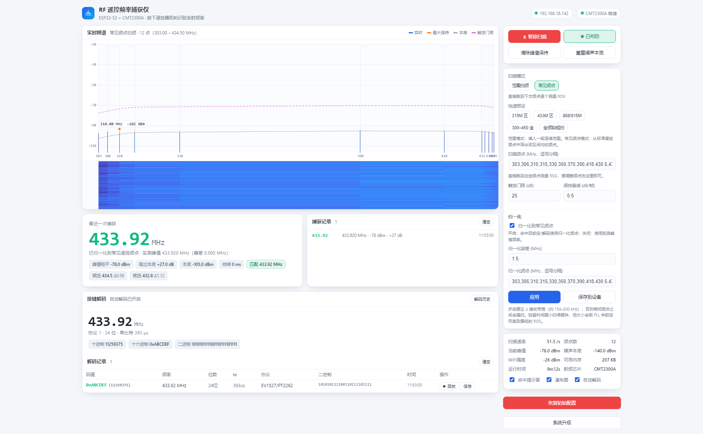
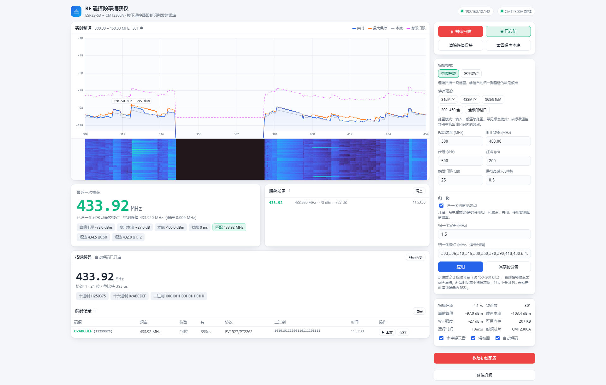
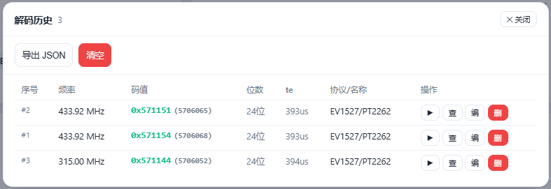

# 射频大师全频版（RF Master）

> ESP32-S3 + CMT2300A 宽频 OOK 遥控信号频谱分析 / 解码 / 回放 一体机

---

## 项目简介

**射频大师全频版**是一个基于 **ESP32-S3 + CMT2300A** 的便携式射频分析工具，专门用于 **315 / 433 / 868 / 915 MHz 等 ISM 频段**（126.33~1020 MHz 可调谐）的 **OOK 遥控信号**频谱观察、协议解码与回放测试。

它可以：

- **实时频谱扫描**：范围扫频 + 常见遥控频点快嗅探，Web 网页实时显示频谱曲线、瀑布图、噪声本底与峰值保持；
- **自动解码**：在常见遥控频点间高速轮转，遥控器按一下即锁频并解出 OOK 编码（EV1527 / PT2262 等时长域协议）；
- **解码历史**：解码结果可手工保存到设备 LittleFS 闪存，支持列表 / 回放 / 查看 / 改名 / 删除 / 导出 JSON / 清空；
- **回放发射**：将解码记录以 **DIRECT OOK** 方式由 CMT2300A 重新发射（RMT 硬件波形，时序精准）；
- **OTA 在线升级**：内置 Web 升级页面，无需拆机刷固件。

## 功能特性

| 特性 | 说明 |
|---|---|
| 宽频接收 | 126.33 ~ 1020 MHz，覆盖 315/433/868/915 等主流遥控频段 |
| 双扫描模式 | 范围扫频（连续大范围）/ 常见频点快嗅探（高速轮转） |
| 实时频谱 | Web 频谱图 + 瀑布图 + 滑动噪声本底 + 峰值保持 |
| 载波命中 | 瞬时 RSSI 高出本底即触发，捕获事件卡片展示 |
| OOK 自动解码 | 时长域解码器，多帧复核抗噪声，支持 EV1527/PT2262 等 |
| 解码历史 | LittleFS 持久化（500 条环形），Web 弹窗管理 |
| 回放发射 | DIRECT OOK + RMT 硬件波形，与量产遥控序列一致 |
| 归一化 | 实测峰值自动吸附到常见遥控频点 |
| OTA 升级 | 集成 ElegantOTA 网页升级，mDNS 自动发现 |

## 运行截图




## 原理简介

### 硬件链路

```
ESP32-S3 (N16R8, 16MB Flash + 8MB PSRAM)
   │ 3线SDIO(软件SPI，GPIO4/5/6/7)
   ▼
CMT2300A 射频收发芯片
   │ RX: GPIO2 → ESP32 GPIO9（解调后的原始OOK码流）
   │ TX: ESP32 GPIO10 → GPIO3（DIN 输入，DIRECT OOK 调制）
   ▼
天线（315/433/868/915MHz 分段匹配网络）
```

### 软件架构

- **驱动层** `cmt2300a_hal`：3 线 SDIO 软件 SPI 读写寄存器，兼容 CMT2300A / CKS2300；
- **芯片驱动** `cmt2300a`：初始化载入 RFPDK 导出配置（OOK / DIRECT 模式）、跳频、发射控制；
- **频谱引擎** `spectrum`：范围扫频 / 快嗅探任务、RSSI 采集、滑动本底、峰值检测、载波命中、OOK 解码调用、DIRECT OOK 回放发射（RMT 波形）；
- **解码器** `ook_decoder`：时长域解码（脉宽直方图 / Te 估计 / 多帧投票复核），GPIO 中断采集边沿；
- **历史存储** `history`：解码记录 JSON 持久化到 LittleFS，判重、环形上限；
- **Web 服务** `web_server`：ESPAsyncWebServer + WebSocket 实时推送频谱 / 捕获 / 解码事件，前端 Canvas 渲染；
- **前端** `data/index.html`：单页应用（频谱图 / 瀑布图 / 捕获卡片 / 解码记录 / 解码历史弹窗 / 参数面板），gzip 内嵌固件。

### 解码原理

CMT2300A 以 **DIRECT 模式**输出解调后的原始 OOK 码流（GPIO2 → GPIO9），ESP32 通过 GPIO 中断采集每个脉宽（µs），解码器按 EV1527 类时长域协议（高/低脉宽比）估计单位脉宽 `te`、切帧、跨帧投票，输出 `{频率, 码值, 位宽, te, 协议名}`。

### 发射原理

回放时主机以 **DIRECT OOK** 模式驱动 CMT2300A：ESP32 用 RMT 外设硬件生成精确的 OOK 波形（`'0'=高1te低3te`、`'1'=高3te低1te`），从 GPIO10 送入芯片 DIN 脚，由片内 PA 直接调制发射——与量产遥控器的时序完全一致。

## 硬件组成

| 器件 | 型号/规格 | 说明 |
|---|---|---|
| 主控 | ESP32-S3-WROOM-1 (N16R8) | 16MB Flash + 8MB PSRAM |
| 射频 | CMT2300A 收发一体芯片 | 126.33~1020 MHz，(G)FSK/OOK |
| 天线 | 315/433/868/915MHz 匹配天线 | 按目标频段选择模块/天线版本 |
| 供电 | USB-C 5V | 板载 LDO 供电 3.3V |

## 接线指导

CMT2300A（QFN16）与 ESP32-S3 接线如下（3 线 SDIO + 2 根功能飞线）：

| CMT2300A 引脚 | ESP32-S3 GPIO | 功能 |
|---|---|---|
| CSB | GPIO4 | 寄存器片选 |
| FCSB | GPIO5 | FIFO 片选 |
| SCK | GPIO6 | 时钟 |
| SDIO (MOSI) | GPIO7 | 数据（双向） |
| MISO | — | 未用（3 线模式） |
| GPIO2 | GPIO9 | DOUT：OOK 解码码流输入（飞线） |
| GPIO3 | GPIO10 | DIN：OOK 发射码流输入（飞线） |
| GPIO1 | — | 无连接（NC） |

> ⚠️ 注意：
> - SDIO 为**双向**数据线，（3 线模式，MISO 不用）；
> - GPIO9 / GPIO10 两根飞线分别为 **RX 解码输入**与 **TX 发射输出**，不可接反；
> - 若使用独立 CMT2300A 模块，请核对模块引脚定义与上述一致。

## 软件使用

### 编译与烧录（PlatformIO）

```bash
# 安装 PlatformIO 后，在项目根目录执行：
pio run                # 编译
pio run -t upload      # 烧录
pio device monitor     # 串口日志（115200）
```

- 框架：Arduino（ESP32 core 3.x）
- 依赖：ESPAsyncWebServer / AsyncTCP / ArduinoJson / ElegantOTA（lib_deps 自动拉取）

### 首次上电

1. 设备上电后自动连接 WiFi（SSID/密码在 `include/config.h` 的 `WIFI_SSID` / `WIFI_PASSWORD`，请改为你自己的）；
2. 连接成功后通过 **mDNS 地址 `http://rfmaster.local/`** 或串口打印的 IP 访问 Web 界面；
3. 若 WiFi 连接失败，自动开启热点 **`rfmaster_XXXX`**（密码 `cmt2300a`），连上后访问 `http://192.168.4.1/`。

### Web 界面操作

1. **扫描**：点击"开始扫描"，选择"范围扫频"（设置起止频率/步进/驻留）或"常见频点"（编辑频点列表）；
2. **自动解码**：开启"自动解码"进入快嗅探——在常见遥控频点间轮转，按一下遥控器即锁频解码；
3. **捕获/解码记录**：主界面实时显示最近一次捕获与解码记录；解码记录每行可 **回放 / 保存**（保存到 LittleFS 历史）；
4. **解码历史**：解码区右上角"解码历史"弹窗——列表 / 回放 / 查看 / 改名 / 删除 / 导出 JSON / 清空；
5. **回放发射**：点击记录行的"▶ 回放"，设备即以 DIRECT OOK 重新发射该码（对准被控设备验证）；
6. **系统升级**：右侧"系统升级"按钮打开 `/update` 网页，选择固件文件在线升级（OTA）。

### 常用参数（`include/config.h` 可调）

| 参数 | 默认 | 说明 |
|---|---|---|
| 扫描频点 | 303/315/433.92/868 等 17 点 | 常见遥控频点 |
| 触发门限 | 30 dB | 高出本底 N dB 判定命中 |
| 驻留时间 | 500 µs/频点 | 快嗅探每频点停留 |
| 解码窗口 | 1000 ms | 命中后采集解码时长 |
| 历史上限 | 500 条 | LittleFS 环形 |

## 固件升级

- 网页在线升级：`http://rfmaster.local/update`（ElegantOTA）；
- 或串口/PlatformIO：`pio run -t upload`。

## 常见问题

- **频谱平线 / RSSI 恒 -128**：确认 CMT2300A 数据模式为 DIRECT（`PKT1[1:0]=0`），3 线 SDIO 接线正确；
- **收不到遥控信号**：检查天线频段是否匹配、触发门限是否过高、频点列表是否覆盖目标频段；
- **回放无效**：确认 GPIO10→GPIO3 发射飞线正确、目标设备与回放频点一致；
- **LittleFS 挂载失败**：首次使用会自动格式化 spiffs 数据分区，等待数秒即可。

## 法律风险提示

> **⚠️ 请务必阅读并遵守：**

1. **合法用途**：本设备仅限用于**自己合法拥有的设备**（如自家车库门、电动门、遥控开关）的测试、教学研究、无线电频谱观测等合法场景；
2. **无线电管理法规**：在中国境内使用、发射无线电信号须遵守《中华人民共和国无线电管理条例》等法律法规，未获许可不得在受限频段发射，或对他人设备、公共服务（航空、安防等）造成干扰；
3. **隐私与安全**：**严禁**用于窃听、拦截、复制他人遥控信号，或侵入、干扰他人门禁、车辆、安防系统等设备——此类行为可能构成违法甚至犯罪；
4. **频段合规**：本项目的回放发射功能工作于 ISM 频段（如 433MHz），不同国家/地区对发射功率、占空比、频段使用有不同规定，使用时请确认符合当地法规；
5. **责任自负**：因使用本设备产生的任何法律后果由使用者自行承担，作者与贡献者对误用行为不负任何责任。

**请做一个合法、负责任的无线电爱好者。**

## 开源许可

本项目以 **MIT License** 开源，详见 [LICENSE](LICENSE)。

- 欢迎在 GitHub 提交 Issue / PR；
- 硬件资料（原理图 / PCB）与固件配合使用，可在 OSHWHub 立创开源硬件平台查看硬件工程。

## 免责声明

本项目仅供学习与合法测试使用。作者不对因使用本项目造成的任何直接或间接损失负责，亦不对使用者违反法律的行为负责。使用本项目即表示你已阅读并同意上述条款。

---

**射频大师全频版 · RF Master** — 让每一个射频信号都清晰可见。
